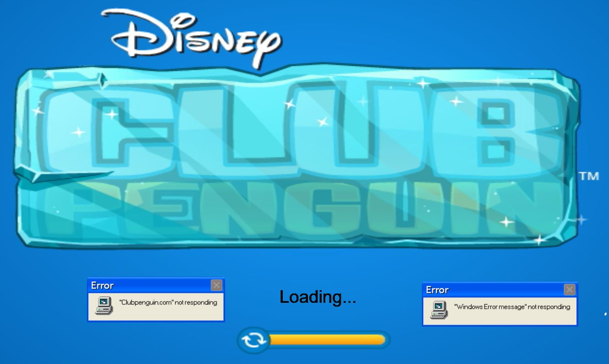

https://rawgit.com/Solution0/Aesthetic-Programming/Github-Desktop/Mini_ex1/empty-example/index.html

# Frustration.io
This is my first p5.js coding experience.
The old saying goes that the more you click, the faster it load. But sometimes it loads so fast that the program crashes. I wanted to capture this feeling of frustration in my first program on p5.js.
It's made in honor of Club Penguin. A fantastic chatroom/website that closed down 30/3-2017.

# The Experience
This coding involved a lot of searching on both on Google and on the p5.js references. A thing that i expected when i dove into this programming language. I have some experience in Java, Unity and C++ and was expecting the frustration i would have myself, when compiling this program. During the time of programming i have scrapped plenty of code and ideas before settling on this one, some more serious than others.

It differed a lot from both reading and writing 'normal' texts. Where i normally would have a more straightforward process i divided my idea into 'Need', 'want' and 'nice to have'. This helped me a lot in structuring what i wanted to code and made simple problems easier to solve. This way of coding also made it easier to go back to older state in which the program worked, if I ever struck a problem.

I wanted to explore and learn conditions and variables in this program, a thing that i find rather hard. But I also feel that these to things make a foundation for more complicated code and programs. I Also wanted to make something dynamic and interactive.

I found the windowWidth, windowHeight and windowResized to be quite useful in making a dynamic program to be ran on whatever window-/screensize. By using those syntaxes I find it easy to place things according to whatever canvas size by using height and width as coordinates. I will most certainly use these functions in later programs and exercises.

i did find it problematic to refresh the canvas/background without constantly redrawing background() in function draw(). noloop() also made it impossible to resize the background. All this led to problems in making dynamic text. In the current state it does not allow 'Error's to stay on screen when resizing(because of Background(img);).

I also experienced the use of a program without function draw(). It made less problems due to the nature of looping in this function.

Next time I would like to dive deeper into variables and conditions. Maybe some kind of mousetracking. I also see Runescape as being a potential resource of inspiration for the next program. Holding on to the idea of fun in programming. 
